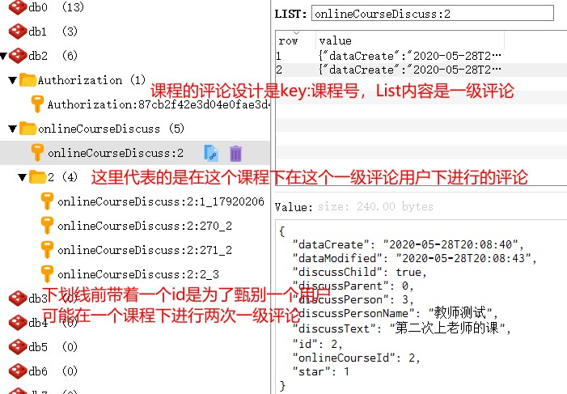
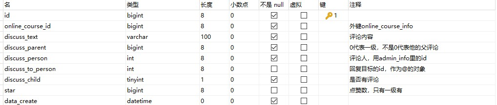

我也不知道我的redis评论设计的对不对，下面的内容都是基于我自身的理解。

<figure>
	<a href="../assets/img/picture/Snipaste_2020-06-02_20-54-37.jpg"></a>
</figure>

设计思路图片中也展示了，大体的思路就是先按照课程分，课程里放的List是一级评论，然后再根据一级评论里的用户来设计在这个评论里评论的人，也就是二级评论,下划线后面是一级评论的用户id，下划线前面那个id是一级评论的主键id。如果不加的话，假设同一个用户发布了两次一级评论，那么在有人对这个用户进行二级评论其实就无法甄别了。

先讲一下，我理解的为什么要用List来做评论而不是用string吧。

1. 首先使用了list在代码上其实要变得比string复杂，尤其是我RedisTemplate使用的还是string类型，还得对List里所有的对象使用fastjson转成string。如果是以object存储的话，进行一个整体的类型转换应该就行了，会简单很多。
2. 然后为什么即便会变的麻烦我还是用了List呢，我觉得要基于一种大体量数据这个点出发来思考，先分析两种类型的存储方式，List类型就有点类似双向链表的操作，左边加入还是右边加入由调用的api决定，string则是将list对象转成string就可以存了。
3. 但这个转换是基于一个整体数据而言，也就是你每一次以这个string类型来存储就意味着你要有整个数据，一个都不能缺，如果数据量大关sql查出就要花很长时间，即便按长度来分键其实治标不治本。
4. 最重要的地方还是在修改添加上，如果以string来添加修改还是前面那个问题，string以一个整体对象来存储，你要修改只能把之前的数据给覆盖掉。而且当你修改添加时是对整个键进行覆盖，也就意味着理论上添加完前你不应该查询这个键。要是你这个键里有10个评论就意味着这10个评论那段时间不能查询。这样一想string类型完全不行呀。
5. 然后list来做的话就是如果添加的话就使用rightpush添加一个，要查询的话还可以配上range来查询。在添加时，添加的数据并不会影响前面list评论的显示。

**说来也有趣，因为打算把这个redis添加评论的代码用来做集成测试作业，然后在写测试用例的过程里基于我是一个恶心的攻击者来思考想到了好几个bug，导致代码更新好几遍，越写越多，也发现了很多之前没注意到的地方。**

## 先展示查询评论的代码，便于理解我这整个redis评论设计

```java

    private static ExecutorService executor = new ThreadPoolExecutor(1,3,2000L, TimeUnit.MILLISECONDS,
            new ArrayBlockingQueue<Runnable>(100),new ThreadFactoryBuilder().setNameFormat("redis-discuss-pool-%d").build(),
            new ThreadPoolExecutor.CallerRunsPolicy());

    public List<OnlineCourseDiscuss> findDiscussByCourseId(Long onlineCourseId, Integer pageStart, Integer pageSize) {
        String key = "onlineCourseDiscuss:" + onlineCourseId;
        //开始得位置
        int start = (pageStart - 1) * pageSize;
        int end = pageStart * pageSize - 1;
        List<OnlineCourseDiscuss> onlineCourseDiscussList = new ArrayList<>();
        if (redisService.listSize(key) > start) {
            List<String> discussList = redisService.range(key, start, end);
            //  转换类型
            for (String discuss : discussList) {
                onlineCourseDiscussList.add(JSON.parseObject(discuss, OnlineCourseDiscuss.class));
            }
            //  第一层遍历
            onlineCourseDiscussList.forEach(onlineCourseDiscuss -> {
                if (onlineCourseDiscuss.getDiscussChild()) {
                    String keyNum = key + ":" + onlineCourseDiscuss.getId() + "_" + onlineCourseDiscuss.getDiscussPerson();
                    List<String> discuss = redisService.range(keyNum, 0, 10);
                    List<OnlineCourseDiscuss> courseDiscusses = new ArrayList<>();
                    //  将内层评论取出
                    for (String data : discuss) {
                        courseDiscusses.add(JSON.parseObject(data, OnlineCourseDiscuss.class));
                    }
                    onlineCourseDiscuss.setOnlineCourseDiscussList(courseDiscusses);
                }
            });
        } else {
            onlineCourseDiscussList = onlineCourseDiscussMapper.findDiscussByCourseId(onlineCourseId, 0L);
            executor.execute(new CourseDiscuss(key, onlineCourseDiscussList, redisService));
            onlineCourseDiscussList.forEach(onlineCourseDiscuss -> {
                if (onlineCourseDiscuss.getDiscussChild()) {
                    List<OnlineCourseDiscuss> courseDiscusses = onlineCourseDiscussMapper
                            .findDiscussByCourseId(onlineCourseId, onlineCourseDiscuss.getId());
                    String keyTwo = key + ":" + onlineCourseDiscuss.getId() + "_" + onlineCourseDiscuss.getDiscussPerson();
                    courseDiscusses.forEach(discuss -> {
                        redisService.rightPush(keyTwo, JSON.toJSONString(discuss));
                    });
                    onlineCourseDiscuss.setOnlineCourseDiscussList(courseDiscusses);
                }
            });
        }
        return onlineCourseDiscussList;
    }
```

代码有点多，总体上查询就是分为redis里数据不存在就查数据库，数据库查出后我是一方面把数据给线程池去创建key，另一方面直接返回这个查询结果。redis里数据有，就查redis。

### 走sql的部分
```java
            String key = "onlineCourseDiscuss:" + onlineCourseId;
         // sql查出的一级评论
            onlineCourseDiscussList = onlineCourseDiscussMapper.findDiscussByCourseId(onlineCourseId, 0L);
            // 提交给线程池执行
            executor.execute(new CourseDiscuss(key, onlineCourseDiscussList, redisService));
            // 遍历通过一级去找二级评论，这地方其实变复杂了我一开始是直接用mybatis把一级二级都查出来。
            // 但因为我用的是list类型，而且还要把对象类型转为String，所以只能拆开
            onlineCourseDiscussList.forEach(onlineCourseDiscuss -> {
                if (onlineCourseDiscuss.getDiscussChild()) {
                    List<OnlineCourseDiscuss> courseDiscusses = onlineCourseDiscussMapper
                            .findDiscussByCourseId(onlineCourseId, onlineCourseDiscuss.getId());
                    String keyTwo = key + ":" + onlineCourseDiscuss.getId() + "_" + onlineCourseDiscuss.getDiscussPerson();
                    courseDiscusses.forEach(discuss -> {
                        redisService.rightPush(keyTwo, JSON.toJSONString(discuss));
                    });
                    onlineCourseDiscuss.setOnlineCourseDiscussList(courseDiscusses);
                }
            });
```

走sql的部分因为我要将List类型转string，所以必要进行一个for循环而且还要使用一次添加一个的方式，逻辑比较简单就是先查一级评论，再拿一级评论去查二级，在这个过程中进行redis的key拼接

<figure>
	<a href="../assets/img/picture/Snipaste_2020-06-02_21-54-09.jpg"></a>
</figure>

数据库表设计如上图，放了一个discuss_child的字段，觉得还挺有用的，是用来判断是否有子评论，用于减少二级评论查询的次数

### 走redis的部分
```java
        String key = "onlineCourseDiscuss:" + onlineCourseId;
        //开始得位置
        int start = (pageStart - 1) * pageSize;
        int end = pageStart * pageSize - 1;
        List<OnlineCourseDiscuss> onlineCourseDiscussList = new ArrayList<>();
        if (redisService.listSize(key) > start) {
            List<String> discussList = redisService.range(key, start, end);
            //  转换类型
            for (String discuss : discussList) {
                onlineCourseDiscussList.add(JSON.parseObject(discuss, OnlineCourseDiscuss.class));
            }
            //  第一层遍历
            onlineCourseDiscussList.forEach(onlineCourseDiscuss -> {
                if (onlineCourseDiscuss.getDiscussChild()) {
                    String keyNum = key + ":" + onlineCourseDiscuss.getId() + "_" + onlineCourseDiscuss.getDiscussPerson();
                    List<String> discuss = redisService.range(keyNum, 0, 10);
                    List<OnlineCourseDiscuss> courseDiscusses = new ArrayList<>();
                    //  将内层评论取出
                    for (String data : discuss) {
                        courseDiscusses.add(JSON.parseObject(data, OnlineCourseDiscuss.class));
                    }
                    onlineCourseDiscuss.setOnlineCourseDiscussList(courseDiscusses);
                }
            });
        }
```

返回的list长度通过range里的参数限制，打算是在前端触发下拉或者到底部再请求更多的评论。然后也是因为string类型的关系，所以必须for一次进行类型转换，逻辑一样，先根据课程找评论，再根据评论找评论里的评论。

## 添加评论的代码

```java

    // 用ReentrantLock来做锁操作
    private static Lock lock = new ReentrantLock();

    @Transactional(rollbackFor = Exception.class, isolation = Isolation.REPEATABLE_READ)
    @Override
    public int insertOnlineCourseDiscuss(OnlineCourseDiscuss onlineCourseDiscuss, Long indexOf) {
        int result = 0;
        //直接先判断用户id和用户name有没有对上，防止恶意添加评论
        if (onlineCourseDiscussMapper.isExist(onlineCourseDiscuss.getDiscussPerson(), onlineCourseDiscuss.getDiscussPersonName()) > 0) {
            //  先判断是否有回复某一用户，有回复说明必定是二级评论，要先判断是否有parent否则说明不是二级评论，直接返回，是二级评论了才进行判断id和nam是否对上
            boolean bool = onlineCourseDiscuss.getDiscussToPerson() == null || (onlineCourseDiscuss.getDiscussParent() != 0 && onlineCourseDiscussMapper
                    .isExist(onlineCourseDiscuss.getDiscussToPerson(), onlineCourseDiscuss.getDiscussToPersonName()) > 0);
            if (bool) {
                result = 1;
            }
        }
        if (result == 0) {
            return 0;
        }
        //  外层key
        String key = "onlineCourseDiscuss:" + onlineCourseDiscuss.getOnlineCourseId();
        //  判断是否是子评论
        if (onlineCourseDiscuss.getDiscussParent() != 0) {
            //  获取父评论
            OnlineCourseDiscuss courseDiscuss = JSON.parseObject(redisService.indexList(key, indexOf), OnlineCourseDiscuss.class);
            if (courseDiscuss == null || !onlineCourseDiscuss.getDiscussParent().equals(courseDiscuss.getId())) {
                logger.error("没有父评论，有人恶意添加评论");
                return 0;
            }
            //  判断是否是第一次添加子评论
            StringBuilder stringBuilder = new StringBuilder();
            stringBuilder.append(key).append(":").append(courseDiscuss.getId()).append("_");
            if (redisService.keys(stringBuilder + "*").size() == 0) {
                courseDiscuss.setDataModified(LocalDateTime.now());
                courseDiscuss.setDiscussChild(true);
                redisService.set(key, indexOf, JSON.toJSONString(courseDiscuss));
            }
            //  评论子Key
            key = stringBuilder.append(courseDiscuss.getDiscussPerson()).toString();
        }
        try {
            //  加锁进行一个同步操作
            try {
                lock.lock();
                onlineCourseDiscuss.setDataCreate(LocalDateTime.now());
                onlineCourseDiscuss.setDataModified(LocalDateTime.now());
                result = onlineCourseDiscussMapper.insert(onlineCourseDiscuss);
                redisService.rightPush(key, JSON.toJSONString(onlineCourseDiscuss));
            } finally {
                lock.unlock();
            }
        } catch (Exception e) {
            result = 0;
            e.printStackTrace();
        }
        return result;
    }
```

总体的设计上是事务注解，隔离级别是可重复度，用于失败回滚。第一步是判断评论用户id和评论用户名称是否对的上，在数据库中id是有外键的所以并不担心不存在的id添加，担心的是评论Id和name对不上，因为我执行添加操作的数据库表name对应的字段是不存在的,而且对name设外键也是没用的的，但redis为了更好的展示是有添加name的所以必须要在第一步对id和name进行一个匹配。如下图

```java
        int result = 0;
        //直接先判断用户id和用户name有没有对上，防止恶意添加评论
        if (onlineCourseDiscussMapper.isExist(onlineCourseDiscuss.getDiscussPerson(), onlineCourseDiscuss.getDiscussPersonName()) > 0) {
            //  先判断是否有回复某一用户，有回复说明必定是二级评论，要先判断是否有parent否则说明不是二级评论，直接返回，是二级评论了才进行判断id和nam是否对上
            boolean bool = onlineCourseDiscuss.getDiscussToPerson() == null || (onlineCourseDiscuss.getDiscussParent() != 0 && onlineCourseDiscussMapper
                    .isExist(onlineCourseDiscuss.getDiscussToPerson(), onlineCourseDiscuss.getDiscussToPersonName()) > 0);
            if (bool) {
                result = 1;
            }
        }
        if (result == 0) {
            return 0;
        }
```

然后再判断是否是一个正确的二级评论回复，因为评论回复必须是一个二级评论。如果我不对评论回复操作进行一个判断的话，我进行一级评论故意带上回复相关的属性的话，我的sql添加是可以成功的，因为流程本就是对的，而且对我的前端展示也不会有影响，但数据库里那一行事实上discuss_to_person字段是有一个数据的。所以如果是评论回复操作的话，就要做一个二级评论判断。

没通过就直接返回。

### 如果是子评论
```java
        //  外层key
        String key = "onlineCourseDiscuss:" + onlineCourseDiscuss.getOnlineCourseId();
        //  判断是否是子评论
        if (onlineCourseDiscuss.getDiscussParent() != 0) {
            //  获取父评论
            OnlineCourseDiscuss courseDiscuss = JSON.parseObject(redisService.indexList(key, indexOf), OnlineCourseDiscuss.class);
            if (courseDiscuss == null || !onlineCourseDiscuss.getDiscussParent().equals(courseDiscuss.getId())) {
                logger.error("没有对应的父评论，有人恶意添加评论");
                return 0;
            }
            //  判断是否是第一次添加子评论
            StringBuilder stringBuilder = new StringBuilder();
            stringBuilder.append(key).append(":").append(courseDiscuss.getId()).append("_");
            if (redisService.keys(stringBuilder + "*").size() == 0) {
                courseDiscuss.setDataModified(LocalDateTime.now());
                courseDiscuss.setDiscussChild(true);
                //  是的话将父评论中字段设为有孩子及子评论
                //  onlineCourseDiscussMapper.updateById(courseDiscuss);
                redisService.set(key, indexOf, JSON.toJSONString(courseDiscuss));
            }
            //  评论子Key
            key = stringBuilder.append(courseDiscuss.getDiscussPerson()).toString();
        }
```

首先要先拿父评论，判断我要评论的这个一级评论是否是真正的我要评论的对象，又或者根本就不存在父评论，这是我担心有人直接用类似postman这样的软件用url带参数的方式来直接访问接口，参数乱带，根本没父评论也能添加进去。

然后进行一个判断是否是第一次添加子评论，对discussChild字段进行修改，告诉父评论你是有子评论的。然后进行一个Key拼接，生成二级评论对应的redis里的key

### 添加评论

```java
        try {
            //  加锁进行一个同步操作
            try {
                lock.lock();
                onlineCourseDiscuss.setDataCreate(LocalDateTime.now());
                onlineCourseDiscuss.setDataModified(LocalDateTime.now());
                result = onlineCourseDiscussMapper.insert(onlineCourseDiscuss);
                redisService.rightPush(key, JSON.toJSONString(onlineCourseDiscuss));
            } finally {
                lock.unlock();
            }
        } catch (Exception e) {
            result = 0;
            e.printStackTrace();
        }
```

因为是评论添加肯定要考虑到高并发情况下的添加，我自己用jmeter测试了下，结果和预期一样。用的是比较熟悉的的ReentrantLock做锁，并不打算锁整个方法，我也只需要保证redis和mysql一起添加，让顺序不要出现问题就可以了。
